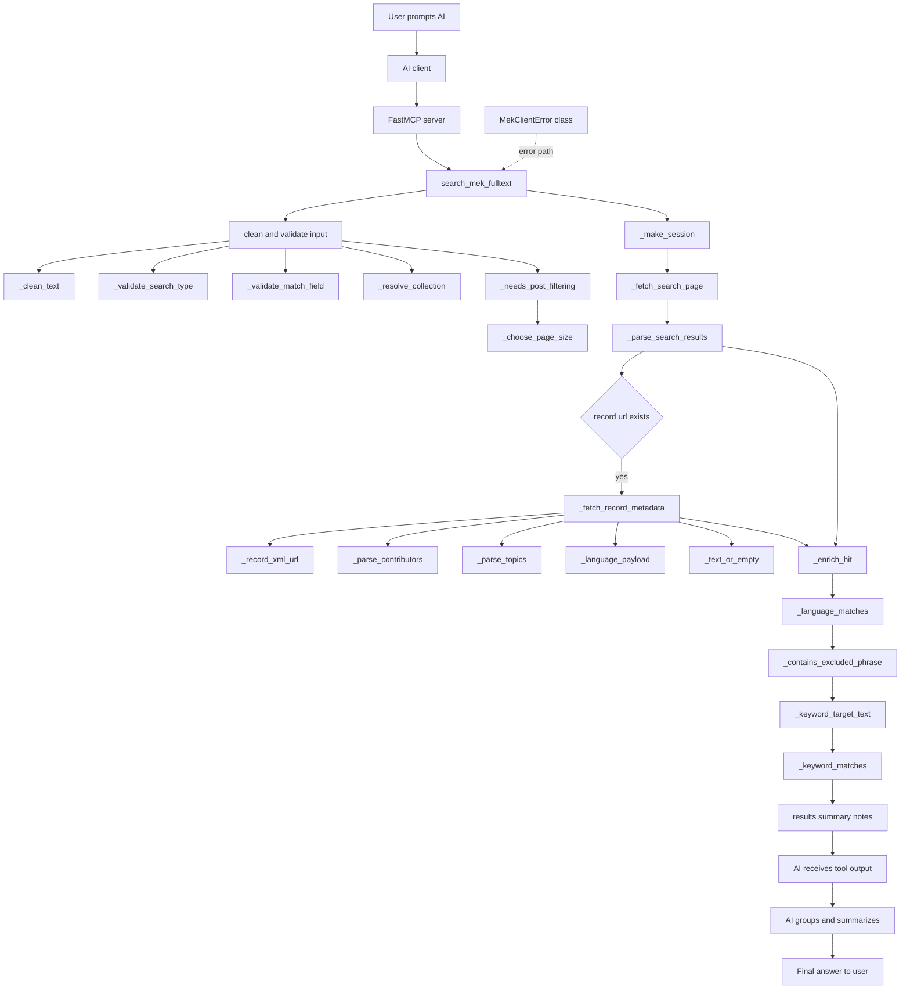

# mcp-server-mek

FastMCP-alapú Python MCP szerver a Magyar Elektronikus Könyvtár teljes szövegű keresőjéhez.

## Fájlok

- `mek_server.py`: a futtatható MCP szerver és a `search_mek_fulltext` tool
- `example_client.py`: minimál FastMCP kliensminta a tool meghívásához
- `smoke_test.py`: gyors helyi ellenőrző script a tool alapválaszára
- `requirements.txt`: a használt Python csomagok rögzített verziói
- `mcp_config.json`: hordozható MCP-konfiguráció
- `.vscode/mcp.json`: workspace-szintű auto-load konfiguráció VS Code-kompatibilis kliensekhez

## Gyors futtatás

Példakliens:

`python3 example_client.py`

Gyors smoke teszt:

`python3 smoke_test.py`

## Folyamat

## Megjegyzés

A MEK jelenlegi publikus teljes szövegű keresőútvonala:

`https://mek.oszk.hu/hu/search/elfulltext/`

A feladatban megadott `https://mek.oszk.hu/hu/search/elfull/` oldal jelenleg az egyszerű keresést szolgálja ki.
